# Field\-Oriented Control of PMSM Using Position Estimated by Neural Network

This [example](https://www.mathworks.com/help/mcb/gs/foc-pmsm-using-position-estimated-by-neural-network.html) shows how to implement field\-oriented control (FOC) of a permanent magnet synchronous motor (PMSM) using a rotor position estimated by an autoregressive neural network (ARNN) trained with Deep Learning Toolbox™.          


An FOC algorithm requires real\-time rotor position feedback to implement speed control as well as to perform mathematical transformation on the reference stator voltages and feedback currents. Traditionally, such algorithms rely on physical sensors. However, due to increased accuracy and cost effectiveness, sensorless position estimation solutions can act as a better alternative to physical sensors.


The example provides one such sensorless solution that uses neural\-network\-based artificial intelligence (AI) to estimate real\-time rotor position. You can use this example to train a neural network using data generated by an existing quadrature\-encoder\-sensor\-based FOC algorithm. The trained neural network acts as a virtual position sensor and estimates the rotor position.


The example guides you through the workflow to train, simulate, and implement the neural network using the following steps:

-  Generate data needed to train the neural network. 
-  Extract relevant data from the generated data. 
-  Concatenate extracted data. 
-  Process concatenated data. 
-  Train the neural network using processed data. 
-  Export the trained neural network to a Simulink® model associated with this example. 

You can then simulate and deploy the Simulink model containing the trained neural network to the hardware and run a PMSM using FOC.


The following figure shows the entire workflow to implement a neural\-network\-based virtual position sensor.


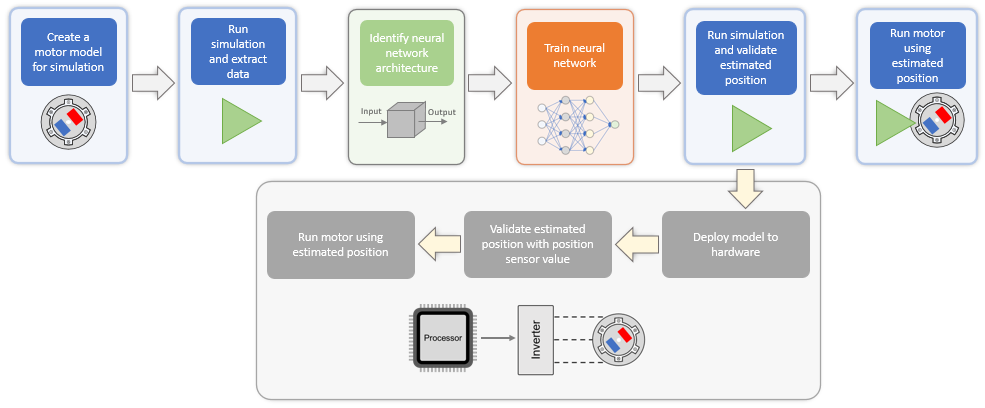


**Note:** 

-  This example enables you to use either the trained neural network or the quadrature encoder sensor to obtain the rotor position. 
-  By default, the example guides you to generate the training data by simulating a model of the motor. However, if you have training data obtained from hardware running an actual motor, you can also use such a data set to train the neural network. 
# Model

The example uses the Simulink model [`mcb_pmsm_foc_qep_deep_learning_f28379d`](matlab:openExample('mcb/FOCPMSMUsingPosEstByNeuralNtwExample','supportingFile','mcb_pmsm_foc_qep_deep_learning_f28379d.slx')).


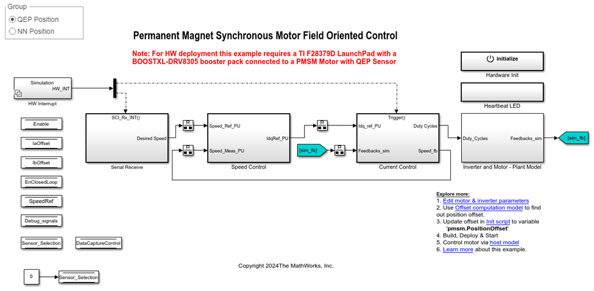


Using this model you can:

-  Generate the data needed to train the neural network. 
-  Accommodate the trained neural network. 
-  Run a PMSM using FOC in simulation or on hardware. 

This model supports simulation and code generation.

## Model Architecture

This figure shows the architecture of the FOC algorithm that the [`mcb_pmsm_foc_qep_deep_learning_f28379d`](matlab:openExample('mcb/FOCPMSMUsingPosEstByNeuralNtwExample','supportingFile','mcb_pmsm_foc_qep_deep_learning_f28379d.slx')) model implements:


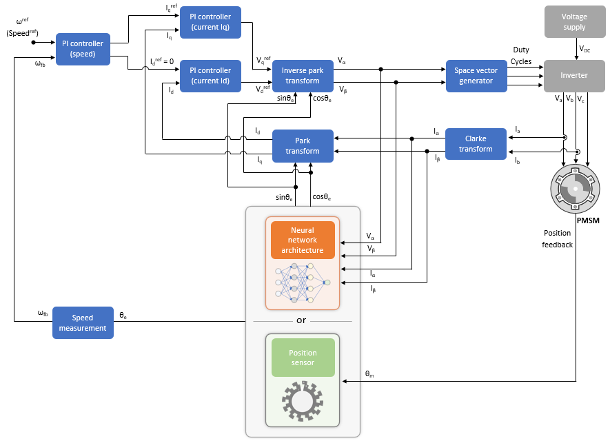


The model enables you to use a trained neural network or the quadrature encoder sensor to get the rotor position.


As shown in the figure, the neural network uses the *Vα*, *Vβ*, *Iα*, and *Iβ* inputs to output *θe*, sin*θe*, and *cosθe*, where:

-  *Vα* and *Vβ* are the voltages across the *α* and *β* axes, respectively (in per\-unit). 
-  *Iα* and *Iβ* are the currents across the *α* and *β* axes, respectively (in per\-unit). 
-  *θe* is the motor electrical position (in per\-unit). 

For more details about the per\-unit (PU) system, see [Per\-Unit System](<docid:mcb_gs#mw_e962ec5d-44da-4cd1-889a-c8b45491450f>).


You must train the neural network by using the *Vα*, *Vβ*, *Iα*, *Iβ*, and *θe*  data so that it can accurately map the inputs into the output and act like a virtual position sensor by estimating the rotor position.

# Generate Training Data from Target Simulink Model

The first step to using the example is to generate the *Vα*, *Vβ*, *Iα*, *Iβ*, and *θe* data needed to train the neural network. You can generate the data by using the `TrainingDataCapture` utility function. This function gets the training data by simulating the model `mcb_pmsm_foc_qep_deep_learning_f28379d.slx`, which contains a quadrature\-encoder\-sensor\-based FOC algorithm. During simulation, the model performs a sweep across speed and torque reference values to capture the electrical position and the *α*\- and *β*\-equivalents of the stator voltages and currents.

## **What Is a Sweep Operation?**

Using a sweep operation, the `TrainingDataCapture` utility function:

1.  Selects a range of speed\-torque operating points.
2. Simulates the model to run the quadrature\-encoder\-based FOC at each operating point (or a reference speed\-torque value pair) for a limited time.
3. After the stator voltages and currents reach a steady state, records the resulting values of *Vα*, *Vβ*, *Iα*, *Iβ*, and *θe*.

The following figures highlight the constant blocks that the utility function uses to select each operating point. The utility function uses:

-  `Block Speed_Training` (available in the `mcb_pmsm_foc_qep_deep_learning_f28379d/Serial Receive/SCI_Rx/Simulation` subsystem) to select a speed reference value. 

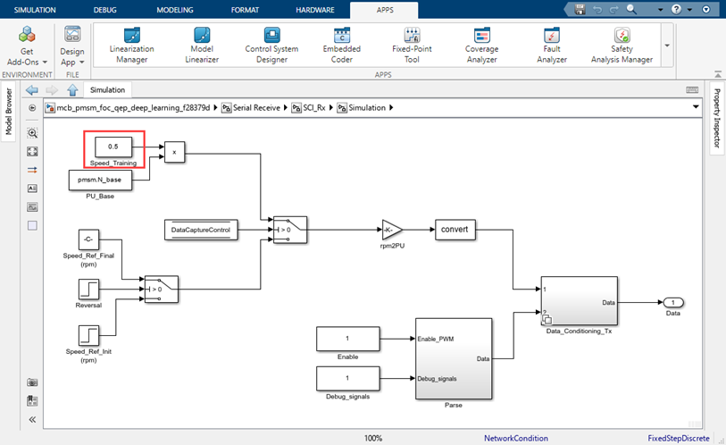

-  `Block Torque_Training` (available in the `mcb_pmsm_foc_qep_deep_learning_f28379d/Inverter and Motor - Plant Model/Simulation/Load_Profile (Torque)` subsystem) to select a speed\-torque operating point. 

 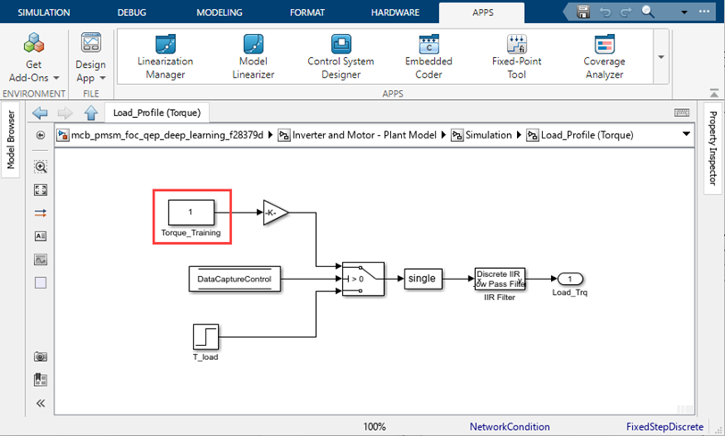

-  Subsystem `mcb_pmsm_foc_qep_deep_learning_f28379d/Current Control/Control_System/Closed Loop Control/Subsystem` to capture the *Vα*, *Vβ*, *Iα*, *Iβ*, and *θe* values that correspond to the captured operating point and records them in a `Simulink.SimulationOutput` object. 

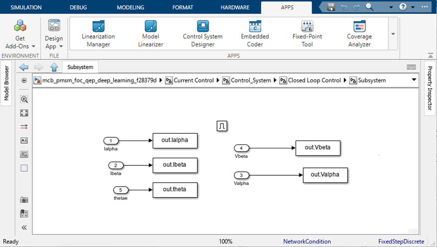


The `TrainingDataCapture` utility function also manually computes and records the *sinθe and cosθe* values for the captured  operating point.

## **Speed Ranges for Sweep Operation**

The `TrainingDataCapture` utility function performs the sweep operation by selecting operating points across these speed ranges:

-  Zero to low\-speed range, which corresponds to 0% to 10% of the motor rated speed. In this range, the utility function minimizes sweep operations for the load torque. Because this speed range shows minimal load torque variations in real\-world applications, the utility function keeps the training data lean in this speed range by maintaining an almost constant torque reference. The utility function primarily varies only speed references and collects only limited training data from this speed range. 
-  Low to high\-speed range, which corresponds to 10% to 100% of the motor rated speed. The utility function creates operating points by varying reference speed and torque values in this speed range to collect the majority of the required training data. 
## **Duration of Capture for Each Operating Point**

The `TrainingDataCapture` utility function simulates the target model at each speed\-torque operating point. After simulation begins for an operating point, the utility function captures the *Vα*, *Vβ*, *Iα*, *Iβ*, and *θe* data for a limited duration defined by these variables:

-  Variables `dCStartTime1` and `dCEndTime1` define the duration of data capture in the zero to low\-speed range. Because of lower motor speeds, the duration of data capture is usually large in this range. 
-  Variables `dCStartTime2` and `dCEndTime2` define the duration of data capture in the low to high\-speed range. Because of higher motor speeds, the duration of data capture is usually small in this range. 

With this approach, the utility function captures data only after the stator currents and voltages reach a steady state (after simulation begins).


You can tune these variables by modifying this live script.

## **Number of Reference Speed and Torque Data Capture Points**

You can also use these variables to define the number of reference speed and torque data capture points.

-  Variable `dPSpdZtoL` `d`efines the number of reference speed points that the utility function uses in the zero to low\-speed range. 
-  Variable `dPSpdLtoH` `d`efines the number of reference speed points that the utility function uses in the low to high\-speed range. 
-  Variable `dPTorLtoH` `d`efines the number of reference torque points that the utility function uses in the low to high\-speed range. 

Because the utility function uses a relatively fixed torque reference during the zero to low\-speed range, the number of reference torque points is fixed in this range.


You can tune these variables by modifying this live script.


The utility function captures, appends, and stores the data for the operating points in the `Simulink.SimulationOutput` object, as this figure shows.


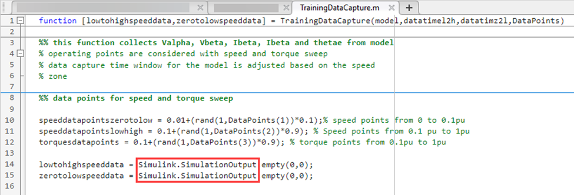


Run this code to generate the training data.


**Note:** Running the `TrainingDataCapture` utility function using these parameters can take approximately three hours.

```matlab
%% Capture the training data using Simulink Environment
model='mcb_pmsm_foc_qep_deep_learning_f28379d';% Minor updates in model required for obtaining training data
dCStartTime1 = 3.8; %dataCaptureStartTime for low to high speed
dCEndTime1 = 4; %dataCaptureEndTime for low to high speed
dCStartTime2 = 3.5; %dataCaptureStartTime for zero to low speed
dCEndTime2 = 4; %dataCaptureEndTime for zero to low speed
dPSpdLtoH =40; %dataPointsSpeedLowtoHigh
dPSpdZtoL = 100;%dataPointsSpeedZerotoLow
dPTorLtoH =25; %data points torque (low(0.1pu) to high(1pu) speed)
[lowtohighspeeddata,zerotolowspeeddata] = ...
    TrainingDataCapture(model,[dCStartTime1,dCEndTime1],[dCStartTime2,dCEndTime2], ...
                        [dPSpdZtoL,dPSpdLtoH,dPTorLtoH]);
```


The `TrainingDataCapture` utility function stores the generated data in these `Simulink.SimulationOutput` objects:

-  Object `zerotolowspeeddata` `s`tores the data obtained by using the sweep operation across the zero to low\-speed range. 
-  Object `lowtohighspeeddata` `s`tores the data obtained by using the sweep operation across the low to high\-speed range. 

To access the `TrainingDataCapture` utility function, click [`TrainingDataCapture`](matlab:openExample('mcb/FOCPMSMUsingPosEstByNeuralNtwExample','supportingFile','TrainingDataCapture.m')).

<a id="H_53d0"></a>

# Refine and Process Data

The next step is to extract the relevant data from the data that you generated in the previous section and then process it.

## **Extract One Electrical Cycle of Data**

In the previous section, for each speed\-torque operating point, the utility function `TrainingDataCapture` captured data for multiple electrical cycles during the time interval defined by the variables `dCStartTime1`, `dCEndTime1`, `dCStartTime2`, and `dCEndTime2`.


You can use the utility function `OneElecCycleExtrac` to refine the extracted data for each operating point by extracting one electrical cycle of data for each operating point.


Use these commands to extract one electrical cycle of data for each operating point captured in the `Simulink.SimulationOutput` objects `lowtohighspeeddata` and `zerotolowspeeddata`.

```matlab
oneCycleDataLtoH = OneElecCycleExtrac(lowtohighspeeddata);
oneCycleDataZtoL = OneElecCycleExtrac(zerotolowspeeddata);
```


The utility function returns the refined data to these `Simulink.SimulationOutput` objects:

-  Object `oneCycleDataZtoL` `s`tores the electrical cycle of data for the zero to low\-speed range. 
-  Object `oneCycleDataLtoH` `s`tores the  electrical cycle of data for the low to high\-speed range. 

To access the `OneElecCycleExtrac` utility function, click [`OneElecCycleExtrac`](matlab:openExample('mcb/FOCPMSMUsingPosEstByNeuralNtwExample','supportingFile','OneElecCycleExtrac.m')).

## **Concatenate One\-Electrical\-Cycle Data**

Use the utility function `DataConcatenate` to concatenate the one\-electrical\-cycle data output.  


Use this command to concatenate the extracted data stored in the `Simulink.SimulationOutput` objects `oneCycleDataZtoL` and `oneCycleDataLtoH`.

```matlab
completeData = DataConcatenate(oneCycleDataLtoH,oneCycleDataZtoL);
```

The utility function returns the concatenated data to the `Simulink.SimulationOutput` object `completeData`.


To access the `DataConcatenate` utility function, click [`DataConcatenate`](matlab:openExample('mcb/FOCPMSMUsingPosEstByNeuralNtwExample','supportingFile','DataConcatenate.m')).

## **Process Concatenated One\-Electrical\-Cycle Data**

This example splits the data obtained after concatenation into these data sets:

-  Training data set, which includes 70% of data in the object `completeData`. The example uses this data set to train the neural network. 
-  Validation data set, which includes the remaining 15% of data in the object `completeData`. The example uses this data set to validate the trained neural network. 
-  Testing data set, which includes the next 15% of data in the object completeData. The example uses this data set to test the trained neural network. 

Run this code to split the data in the object `completeData:`

```matlab
tPLtoH=dPSpdLtoH*dPTorLtoH; % Total data points from speed and torque sweep in the low to high range
tPZtoH=(dPSpdLtoH*dPTorLtoH)+dPSpdZtoL; % Total data points from speed and torque sweep in the zero to high range
[traindatain,traindataout,testdatain,testdataout,validatedatain,validatedataout] ...
          = DataPreparation(completeData,tPLtoH,tPZtoH)
```

The utility function `DataPreparation` accepts these arguments:

-  Object `completeData` `Simulink.SimulationOutput`, which stores the output of the `DataConcatenate` utility function 
-  Variable `tPLtoH`, which corresponds to `dPSpdLtoH` $\times$ `dPTorLtoH` 
-  Variable `tPZtoH`, which `c`orresponds to *(*`dPSpdLtoH` $\times$ `dPTorLtoH`*)* + `dPSpdZtoL` 

The function returns the split data and stores it in these `dlarray` objects:

-  Object `traindatain`, which `s`tores the portion of the training data set that the neural network uses as input. 
-  Object `traindataout`, which `s`tores the portion of the training data set that the neural network uses as output. 
-  Object `testdatain`, which `s`tores the portion of the testing data set that the neural network uses as input. 
-  Object `testdataout`, which `s`tores the portion of the testing data set that the neural network uses as output. 
-  Object `validatedatain`, which `s`tores the portion of the validation data set that the neural network uses as input. 
-  Object `validatedataout`, which `s`tores the portion of the validation data set that the neural network uses as output. 

To access the `DataPreparation` utility function, click [`DataPreparation`](matlab:openExample('mcb/FOCPMSMUsingPosEstByNeuralNtwExample','supportingFile','DataPreparation.m')).

<a id="H_26d6"></a>

# Train and Test Neural Network

The next step is to select a neural network and train it by using the processed data that you generated in the previous section.


This example uses an autoregressive neural network (ARNN) and this series\-parallel architecture:


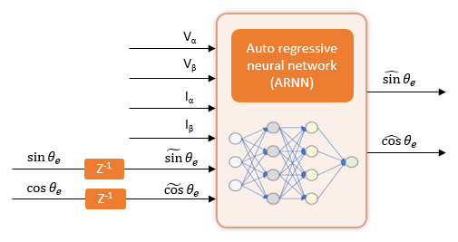


In the figure:

-  *Vα*, *Vβ*, *Iα*, *Iβ*, $\sin \theta_e$, and $\cos \theta_e$ are the true values of the time\-series training data input. 
-  $\sin^{\sim } \theta_e$ and $\cos^{\sim } \theta_e$ are the true values of the time\-series training data input with a delay of one sample time. 
-  $\sin^ˆ \theta_e$ and $\cos^ˆ \theta_e$ are the output predicted by the neural network. 

The series\-parallel architecture uses the *Vα*, *Vβ*, *Iα*, *Iβ,* $\sin^{\sim } \theta_e$, and $\cos^{\sim } \theta_e$ input to predict the $\sin^ˆ \theta_e$ and $\cos^ˆ \theta_e$ output.


You can design and train this neural network by using either of these deep learning frameworks:

-  MATLAB Deep Learning Toolbox 
-  PyTorch 
## Design and Train Neural Network in MATLAB

The Deep Learning Toolbox product provides functions, apps, and Simulink blocks for designing, implementing, and simulating deep neural networks.  You use MATLAB code to design, train, and test your neural network. Then, you can export the network to Simulink for deployment to hardware.


The example provides you with the utility function `CreateNetwork` to train a neural network and build a nonlinear ARNN that can estimate rotor position. The utility function `CreateNetwork` uses the Deep Learning Toolbox object [`dlnetwork`](<docid:nnet_ref#object_dlnetwork>) and function [`trainnet`](<docid:nnet_ref#mw_87a4761c-af20-4e6e-9752-e145a8295c97>) to create and train a neural network.


Use this code to train, test, and validate the neural network.

```matlab
[posnet,testdatamse] = CreateNetwork(traindatain,traindataout,testdatain, ...
                                 testdataout,validatedatain,validatedataout)
```

The utility function `CreateNetwork` specifies the `dlarray` objects `traindatain`, `traindataout`, `testdatain`, `testdataout`, `validatedatain`, and `validatedataout` and returns the trained ARNN and the mean\-square error information to this object and variable:

-  Object  `posnet dlnetwork`, which stores the trained ARNN 
-  Variable `testdatamse`, which stores the mean squared error information that the utility function generated from the testing data set 

The `CreateNetwork` utility function generates a trained ARNN that contains two fully connected layers and an activation layer. 


This figure shows the code that defines the neural network layers.

<a id="M_8a3e"></a>

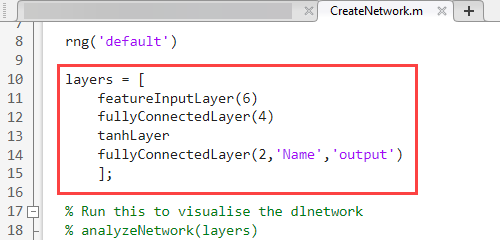


To access the `CreateNetwork` utility function, click [`CreateNetwork`](matlab:openExample('mcb/FOCPMSMUsingPosEstByNeuralNtwExample','supportingFile','CreateNetwork.m')).


For more detail about the training process, see [Building Neural Network for Virtual Position Sensing](<docid:mcb_gs#mw_ba24d56b-f11d-4792-8a3d-fb8a4c9be7df>).

## Design and Train Neural Network in PyTorch

If you prefer to work in other deep learning frameworks, such as PyTorch, you can use the Deep Learning Toolbox to import an existing neural network into MATLAB and deploy the network by using Simulink.


This example provides the PyTorch script `createNetworkPy.py` for training a neural network of the architecture described in [Design and Train Neural Network in MATLAB](#M_8a3e). The script uses the same data that the MATLAB approach uses and captures the data in the `dlnetwork` object `completeData`. 


In MATLAB, prepare the data for use in the PyTorch script:

```
prepareDataPy(completeData)
```

The PyTorch script `createNetworkPy.py` exports the trained neural network from PyTorch in the ONNX format, which facilitates importing the network into MATLAB. 


In MATLAB, import the network.

```
posnet = importNetworkFromONNX("mlp_model.onnx","InputDataFormats","BC", ...
    "OutputDataFormates","BC")
```

The `dlnetwork` object that this command creates contains the same layers as the neural network designed by using the Deep Learning Toolbox and a custom output layer. The custom output layer is not needed.  Remove that layer when you export the network to a Simulink model.

<a id="H_892e"></a>

# Export Trained Neural Network to Simulink Model

After you train the neural network, export the trained ARNN to a Simulink model by using the Deep Learning Toolbox function `exportNetworkToSimulink`. This function exports the trained ARNN network `net` to Simulink layer blocks that you can include in a model for simulation and code generation.


Export the trained ARNN `net` to Simulink layer blocks.

```matlab
exportNetworkToSimulink(posnet)
```

The `exportNetworkToSimulink` function uses the `dlnetwork` object `net` to create the Simulink layer blocks in a new Simulink model, as this figure shows.


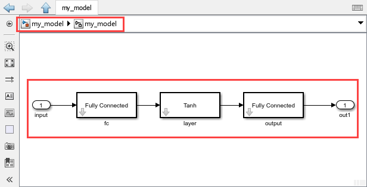


If you export the `dlnetwork` object `net` that was created by importing a PyTorch neural network, the `exportNetworkToSimulink` function adds a placeholder subsystem `outputOutput` before the model output. Before using the  layer blocks created during the export operation, replace the placeholder subsystem with a Reshape block, as this figure shows. 


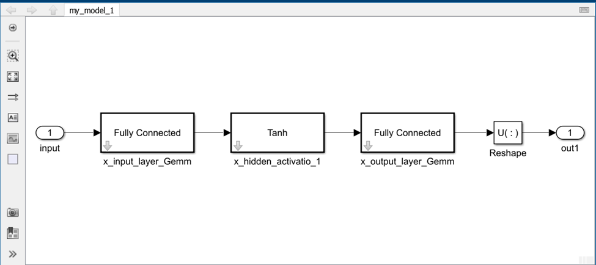


The Reshape block adjusts the dimensionality of the input signal to a dimensionality that you specify for the output.


Copy the blocks that are in the generated model. Then, in the example model `mcb_pmsm_foc_qep_deep_learning_f28379d.slx`, paste the copied blocks in the subsystem `mcb_pmsm_foc_qep_deep_learning_f28379d/Current Control/Neural Network Observer/Neural Network/NN_Model_ARNN.`


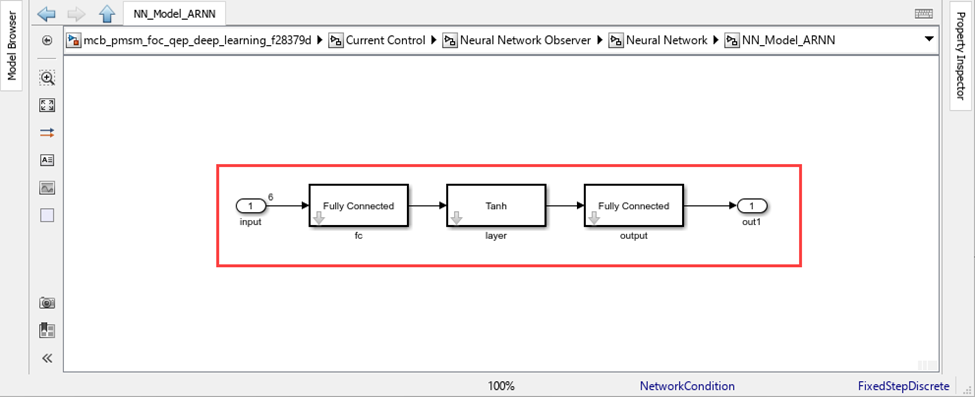


These figures show the resulting architecture of the ARNN, which  acts as a virtual position sensor. To achieve optimal performance with timeseries predictions, the example provides the previous output values (*sinθe and cosθe*) as additional inputs (with a delay).


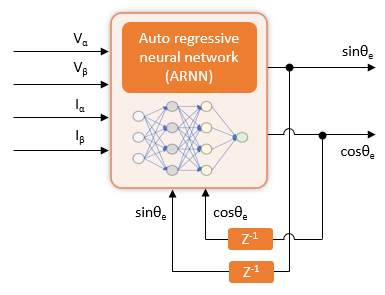


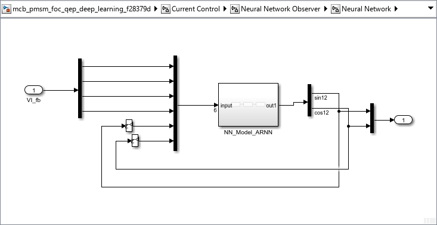


Example model `mcb_pmsm_foc_qep_deep_learning_f28379d.slx` provides you with an option to switch between neural network\-based and quadrature encoder\-based position sensing.

<a id="H_3def"></a>

# Simulate and Deploy Code

After you export the neural network to Simulink, run this command to open the updated model.

```matlab
open_system('mcb_pmsm_foc_qep_deep_learning_f28379d.slx');
```
<a id="H_81a7"></a>

## Simulate Target Model

**1.** In the target model `mcb_pmsm_foc_qep_deep_learning_f28379d.slx`, click one of these buttons:

-  **QEP Position** to use the quadrature encoder position sensor 
-  **NN Position** to use the neural network that you trained using this example 

**2.** Simulate the model. On the **Simulation** tab, click **Run**.


**3.** View and analyze the simulation results.On the **Simulation** tab, click **Data Inspector.**


This figure compares the position obtained by using the quadrature encoder sensor and the position estimated by the trained neural network.


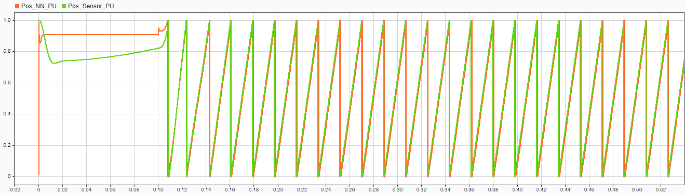

## Required Hardware

This example supports the LAUNCHXL\-F28379D controller + BOOSTXL\-DRV8305 inverter hardware configuration.

## **Generate and Deploy Code to Target Hardware**

**1.** Simulate the target model and observe the simulation results.


**2.** Complete the hardware connections. For details about hardware connections related to the LAUNCHXL\-F28379D controller + BOOSTXL\-DRV8305 inverter hardware configuration, see [LAUNCHXL\-F28069M and LAUNCHXL\-F28379D Configurations](<docid:mcb_gs#mw_8a869325-5b0d-4631-afd5-05a23622cc5c>).


**3.** The model automatically computes the ADC (or current) offset values. To disable this functionality, which is  enabled by default, in the model initialization script, change the value of the variable `inverter.ADCOffsetCalibEnable` to 0. Alternatively, in the model initialization script, you can compute the ADC offset values and update the variable setting manually. For instructions, see [Run 3\-Phase AC Motors in Open\-Loop Control and Calibrate ADC Offset](<docid:mcb_gs#mw_2d4f6f28-855c-4e0c-b977-bf5b93a09227>).


**4.** To use the trained neural network for position estimation, in the model, click the **NN Position** button.


**5.** To use the quadrature encoder sensor, in the model, click the **QEP Position** button. In addition, compute the encoder index offset value and update it in the model initialization script associated with the model. For instructions, see [Quadrature Encoder Offset Calibration for PMSM Motor](<docid:mcb_gs#mw_52571b8e-639e-4a24-a8bf-b644eb78edc1>).


**6.** Load a sample program, such as a program that operates the CPU2 blue LED, to CPU2 of LAUNCHXL\-F28379D, by using GPIO31 (`c28379D_cpu2_blink.slx`). Doing so prevents CPU2 from being mistakenly configured to use the board peripherals intended for CPU1. For more information about the sample program or model, see the Task 2 \- Create, Configure and Run the Model for TI Delfino F28379D LaunchPad (Dual Core) section in [Getting Started with Texas Instruments C2000 Microcontroller Blockset](<docid:c2b_ug#mw_4dc3a55d-e3bc-4773-a16c-67d60b5331bb>).


**7.** Deploy the target model to the hardware. On the **Hardware** tab, click **Build, Deploy & Start**.


**8.** Open the associated host model. In the model, click [host model](matlab:openExample('mcb/FOCPMSMUsingPosEstByNeuralNtwExample','supportingFile','mcb_pmsm_foc_deep_learning_host_model_f28379d.slx')). For details about the serial communication between the host and target models, see [Host\-Target Communication](<docid:mcb_gs#mw_7d703f4b-0b29-4ec7-a42b-0b300f580ccc>).


**9.** In the model initialization script associated with the target model, specify the communication port by using the variable `target.comport`. The example uses this variable to update the **Port** parameter of the Host Serial Setup, Host Serial Receive, and Host Serial Transmit blocks available in the host model.


**10.** In the host model, update the **Reference Speed (RPM)** value. 


**11.** Run the host model. On the **Simulation** tab, click **Run**.


**12.** Start running the motor by changing the position of the **Start / Stop Motor** switch to **On**.


**13.** Use the display and scope blocks available on the host model to monitor the debug signals.


*Copyright 2025 The MathWorks, Inc.*

